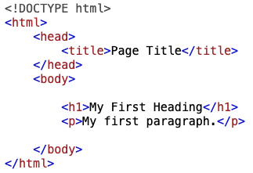
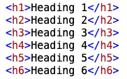
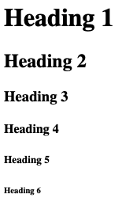
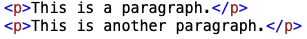
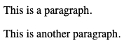
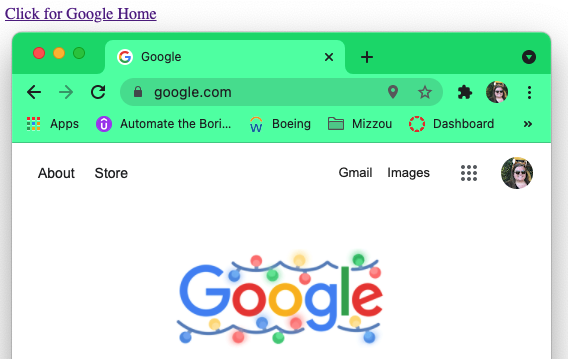

# HTML Basics

### Example Break Down:

| < Code >  | Meaning |
| --------  | ----------- |
| < !DOCTYPE html >       | This shows the user that the document is HTML5, a structure of the web.   |
| < html > | This is what shows the code is using html as the syntax |
|  < head > | This shows the meta information of the page |
| < title >    | This shows a title for the web application; This will appear in the browsers title bar. |
| < body >    | This is a container of everything that is in the body of the web app, most everything will be located within. |
| < h1 >    | Defines a large header, works very similar to # in markdown. The higher the number, the smaller the text will appear. |
| < p >    | Defines a simple paragraph tag. |

## Headers
 

The :arrow_double_up: is an example of what the tag will look like in the editor.

This :arrow_double_up: is the outcome of the code being ran. 

## Paragraph

The :arrow_double_up: is an example of what the tag will look like in the editor.

This :arrow_double_up: is the outcome of the code being ran. 

##### There are many more tags that can be used in HTML

## Links

The :arrow_double_up: is an example of what the tag will look like in the editor.

This :arrow_double_up: is the outcome of the code being ran. 

#### Click any link to visit another page!

+ [Introduction](introduction.md)
+ [Basics](basics.md)
+ [CSS](css.md)
+ [Home](readme.md)

