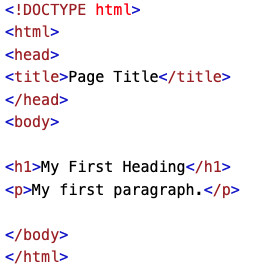

# Introduction
What is HTML?

+ Hyper Text Markup Language
+ Standard language for creating all kinds of web pages
+ Describes the structure of a web page
+ Tells the browser how to structure and display things on a page

## Simple HTML Example

Lets break this image down into specifics!

+ [Introduction](introduction.md)
+ [Editors](editors.md)
+ [Basics](basics.md)
+ [CSS](css.md)

